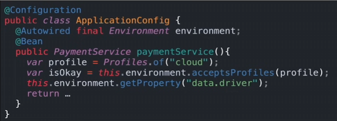
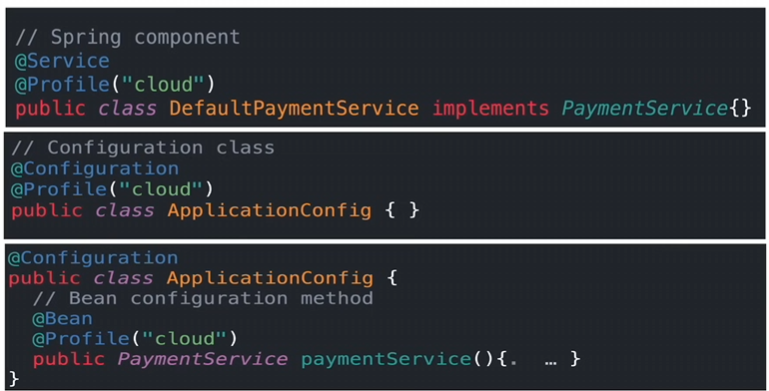
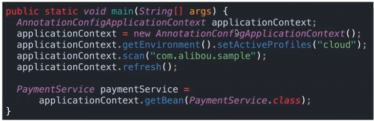
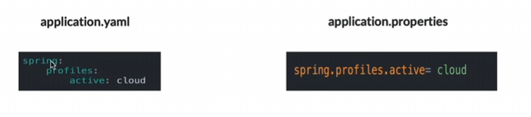
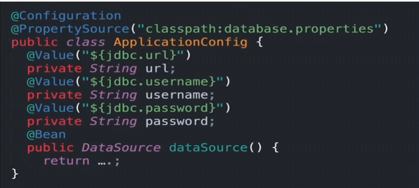

# Spring Framework notes

# Core concepts
## IoC (Inversion of control):
- Design Principle
- Control of object creation and flow is inverted from the class itself to an external entity.

## DI (Dependency Injection): 
- Design pattern for loose coupling
- Instead of class creating its own dependencies, provided from outside
- Implementation of IoC

## Spring Bean:
- Plain Old Java Object(POJO) managed by Spring Framework (IOC container)
- Configured using XML/Annotations/Java Code
- POJO annotated with @Component, @Service etc.
- Defined in a configuration class with @Configuration and @Bean
    - Configuration Class - POJO annotated with @Configuration

### Life cycle of a Bean:
1. IOC Container started
2. Container create instance of Bean
3. Dependencies are injected
4. Bean is destroyed when container is closed

## IOC container : 
- Configure & manage Java Objects or **Spring Beans** - declared with @component, @service etc.
- Responsible for lifeCycle of Beans
- Uses Dependency injection (DI) to provide object reference during runtime

### Configuring Spring Beans
#### Using Java Code
- @Configuration 
    - Create Configuration class - Define how and which beans to create and manage
    - Source of bean definations - Centralize bean defination in one place - replace XML based config
    - Declares Bean producing methods with @Bean
    - Usage 
        - Define Bean with complex initialization logic
        - Confiture third-party objects
        - Setup dependencies between multiple beans
    - Behaviour
        - When one Bean calls another within same config class, IOC container intercepts and returns singleton instance - Ensures Singleton Beans inside same config class
        - Proxied with CGLIB
        - Code Example
    ```java
        @Configuration
        public class AppConfig {

            @Bean
            public MyDataSource dataSource() {
                return new MyDataSource();
            }

            @Bean
            public MyService myService() {
                // The CGLIB proxy intercepts this call and returns the *same* singleton
                // instance of MyDataSource every time.
                return new MyService(dataSource()); 
            }
        }
    ```
    *Class must be non-final and public*
- @Bean - declares method as a bean producer
- @Bean("name") - Set Bean by name when multiple beans of same type exist in the application context

- @Component
    - Register class as a Spring managed component
    - Spring Handles Bean Lifecycle
    - New Instance is created for each @Bean method call
    ```java
        @Component
        public class AppComponents {

            @Bean
            public MyDataSource dataSource() {
                return new MyDataSource();
            }

            @Bean
            public MyService myService() {
                // This will create a *new* instance of MyDataSource every time
                return new MyService(dataSource()); 
            }
        }
    ```
- @Autowired - Find and inject required dependencies into a component
    - *Not needed* when only one constructor

## Sub-types of Spring Components
- @Component - General Component annotation - indicates class should be initialized, configured & **managed by IOC container**.
- Components Meta-annotated with @Component
    - @Repository
    - @Service
    - @Controller

## Bean Naming
Manual Naming
```java
@Bean("ds") // Bean name is set as "ds"
public DataSource dataSource(){
    return(...);
}
```
Default Naming - Spring uses method name as Bean name
```java
@Bean
public PaymentService(){ // Bean name is set as PaymentService
    return new PaymentServiceImpl();
}
```

## Types of Dependency Injection
### Constructor Injection
```java
public class Car {
    private final Engine engine;

    public Car(Engine engine) { // Engine is injected via the constructor
        this.engine = engine;
    }
}
```
### Field Injection
```java
public class Car {
    @Autowired // Injected directly into the field by a framework
    private Engine engine;
}
```
### Method Injection (Used in Configuration Methods)
```java
@Configuration
public class AppConfig {
    @Bean
    public Engine myEngine() {
        return new Engine(); // Engine is created and managed by this method
    }
}
```
### Setter Methods Injection
```java
public class Car {
    private Engine engine;

    public void setEngine(Engine engine) { // Engine is injected via a setter method
        this.engine = engine;
    }
}
```

## Mechanism for Dependency Resolution
### Type injection
```java
// PaymentService.java
public interface PaymentService {
    void processPayment();
}

// CreditCardPaymentService.java
@Component
public class CreditCardPaymentService implements PaymentService {
    @Override
    public void processPayment() {
        System.out.println("Processing credit card payment...");
    }
}

// ShoppingService.java
@Service
public class ShoppingService {
    private final PaymentService paymentService;

    // Type injection via constructor
    public ShoppingService(PaymentService paymentService) {
        this.paymentService = paymentService;
    }

    public void checkout() {
        System.out.println("Beginning checkout process.");
        paymentService.processPayment();
    }
}
```
*Fail on multiple beans: If more than one bean of the same type exists, Spring throws a **NoUniqueBeanDefinitionException**, unless further disambiguation is provided.*

### Named injection
Using **@Qualifier** - attribute used to resolve ambiguity when multiple beans of the same type exist

**@Primary** - Set a default bean for when no qualifier is specified
```java
// NotificationService.java
public interface NotificationService {
    void send(String message);
}

// EmailService.java
@Component("emailService")
@Primary // used as default when no qualifier is specified
public class EmailService implements NotificationService {
    @Override
    public void send(String message) {
        System.out.println("Sending email: " + message);
    }
}

// SmsService.java
@Component("smsService")
public class SmsService implements NotificationService {
    @Override
    public void send(String message) {
        System.out.println("Sending SMS: " + message);
    }
}

// OrderService.java
@Service
public class OrderService {
    private final NotificationService notificationService;

    // Use @Qualifier to specify which bean to inject
    public OrderService(@Qualifier("emailService") NotificationService notificationService) {
        this.notificationService = notificationService;
    }

    public void placeOrder(String orderId) {
        System.out.println("Order " + orderId + " has been placed.");
        notificationService.send("Your order " + orderId + " is confirmed.");
    }
}
```

## Bean Scope
- Life Cycle of Bean - Availability in the context of application
- When looking for beans, Bean Scope determines lifeCycle and which beans it can interact with
- Spring Provides Multiple Scopes
- Default is **Singleton** - helps making it thread safe
### Define Bean Scope in code
```java
@Configuration
public class MyConfiguration {
    @Bean
    @Scope("prototype")
    public Bean1 bean1() { }

    @Bean
    @SessionScope // recommended way to define a bean
    public Bean2 bean2() { }
}
```
### Types of Bean Scoping provided by Spring
1. Singleton - Only one instance is created - default scope
2. Prototype - New instance is created each time a bean is requested - carry state for user or thread - cannot be shared
3. Request - New Bean created for each HTTP request - Only Valid for a single http request
4. Session - New Bean is created for each session - Valid for a session
5. Application - Valid for a Lifecycle of a servelet context
6. WebSocket - Valid for a lifecycle of a websocket

## Special Spring Bean
### Bean Environment
- Provides Access to config sources
- eg. system properties, env variables etc.
- Determines which profile are active
- injectable



### Bean Profile
- Group sets of config properties
- Conditional Bean loading: Beans are only registered with spring container if associated profiles are active
- Can have multiple active profiles - profile loaded last will overwrite existing properties
#### **@Profile** to control which bean is loaded

#### Programmatical profile Activation

#### Activated by **spring.profiles.active**


## @Value Annotation
- Used at field | constructor | parameter level
- Expression driven dependency injection
- Inject Value into variable in a class
- Used with @PropertySource()
- Data comes from Properties files | system properties | hardcoded
### Example

### Dynamic Expression to resolve Beans


## @PropertySource
- Used to Load Properties from other sources
- Example:
``` java
@PropertySource("classpath:Custom.Properties")
```
or
``` java
@PropertySource("file:/path/to/my.properties")
```
### @PropertySources
```java
@PropertySources({
    @PropertySource("classpath:custom.properties1")
    @PropertySource("classpath:custom.properties2")
})
```

## AOP (Aspect Oriented Programming)
- Paradigm for modularity of cross-cutting concerns
- Cross-cutting concern - feature that affects multiple parts of system - eg. Logging, Security etc
- Works by creating proxy object at runtime
- Intercepts method calls and executes additional code

- __Parts of AOP__
    - **Aspect** - Cross-cutting concern logic
    - **Join Point** - specific execution point of method that is intercepted
    - **Advice** - action taken by aspect at a Join point - @After, @Before, @AfterThrowing etc.
    - **Pointcut** - expression that targets methods in a class / matches specific set of Join points - AspectJ pointcut expression language
    - **Target Object**/**Target Bean** - method with business logic
    - **AOP Proxy**/**Advised Bean** - A Wrapper around the target object - replace instance with proxy - intercepts method calls - generated at runtime
    - **Weaving** - The process of applying an aspect to target obejct at runtime - create *Advised Object*

    

    Here **userServiceMethods()** is an alias for pointcut expression - Named pointcut

## Data Access Framework (DAF) / Data Access Layer (DAL)
- High Level Architectural Concept
- Responsible for interaction with data sources
- Uses **Data Access Object(DAO)** pattern
    - Entity/Model
    - Repository/DAO
    - Service
    - Controller

## Best Practices in Spring
### 1. Split Config classes in multiple classes | Import Config using @Import()
Example
```java
@Configuration
public class ServiceConfig{
    @Bean
    public PaymentService paymentService() { }
}

@Configuration
public class RepositoryConfig{
    @Bean
    public AccoauntService accountService() { }
}

@Configuration
@Import({ServiceConfig.class, RepositoryConfig.class})
public class AppConfig{
    @Bean
    public DataSource dataSource() { }
}
```

### 2. Spring Initializer - Generate Spring Template


## MVC
- Request-Response Based framework
- Build using MVC pattern

### MVC Annotations:
- `@Controller`
- `@Response`
- `@RestController`
- `@GetMapping`, `@PostMapping`,`@PutMapping`, `@PatchMapping`, `@DeleteMapping`
- `@ResponseStatus`
- `@RequestBody`- Read Body from request
- `@JsonProperty` - Alias for Fields
- `@PathVariable` - Read Path Parameter from URI
- `@RequestParam` - Read Query parameter from URI
---
- `@Entity` - Make db models from POJO
- `@Table` - Set Table/Entity Properties
- `@Column` - Set Column/Field Properties
- `@ID` - Set PK
- `@GeneratedValue` - Generate values for PK - use with @ID - generation type = strategy for generation
- `@OneToOne()`
    - MappedBy
    - Cascade - CascadeType
- `@ManyToOne()`
    - MappedBy
    - Cascade 
- `@JoinColumn()` - name - 
- `@JsonManage` - Marks the field that owns the relationship - required unless relationship is unidirectional
- `@JsonBackReference` - Marks the field is child in relationship

## Spring Data JPA
- Finder Methods -  Automatically translated into SQL queries by Spring Data JPA
    - Example - `findByName()`, `findByEmail()`